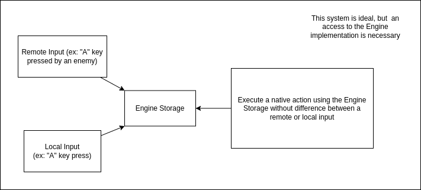
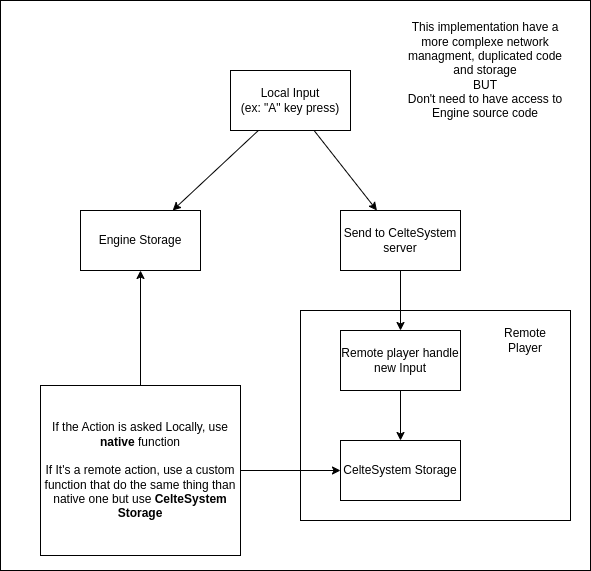
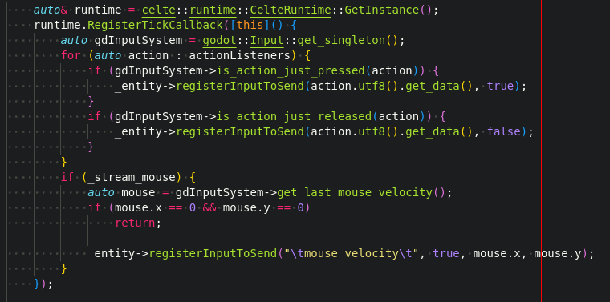
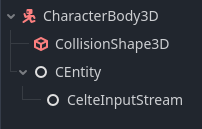
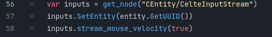
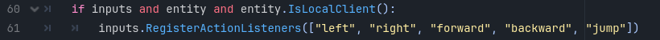
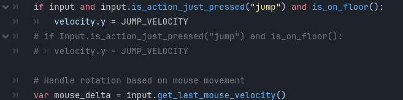

# Celte Input System in the Engine Extention

The **Celte Input System** have a very basic function to give to the **Extention** all the liberty to adapt itself and customize his implementation.

The goal of this implementation is to have a tool that is the closest to the **Engine Native Input system** for a different reason:

* not having to reimplement all the input system to switch from normal to Celte inputs
* not having to learn a new system, function name etc...

For those reasons we have 2 implementation possible, the one we choose depend if you have access to the **Engine source code** or not.

This implementation is the most wanted to but an access to the **Engine source code** is necessary

This implementation duplicates all the **Engine Native** inputs related functions and is more complex

### How to send inputs

As you can see we have a thread that check the status of  the registered inputs using the **Engine Native System**, same goes for the mouse velocity. This way the Inputs are automatically sent without the game developers having to worry.

After that he registers the new input using the **CelteEntity**.

This code will be adjusted to the different needs (use of a joystick, mouse click...)

### How to use remote inputs

As you can see, this function has the same name as the Godot Native function, it's separeted in 2 parts.

If the Client is local, it mean that we are the local player and we use the **Engine Native System**

If we are the Remote player, we have to simulate the **Engine Native System** using the remote information

The Main problem with this implementation is that we need to reimplement all the Engine Native functions to add the remote case, which duplicates a lot of code.

### How to use it in the Engine

1. You need to add a CelteInputStream to your CEntity
   

2. You need to setup the entity uuid and if you use mouse mouvments
   

3. Registers the list of inputs to listen
   

4. Use the celte input instead of the native one
   

### Warning

Even if the implementation logic itself shouldn't change, the rest of the code in the screenshot can be deprecated.

Think about checking the current status before working.
