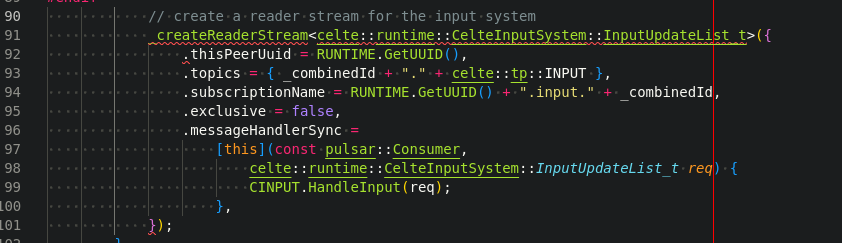
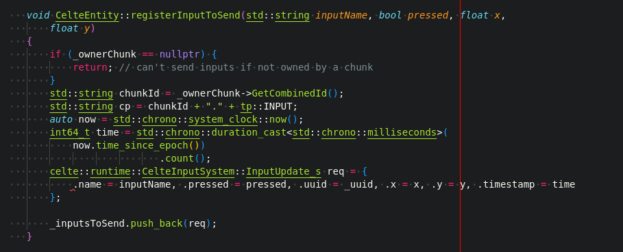
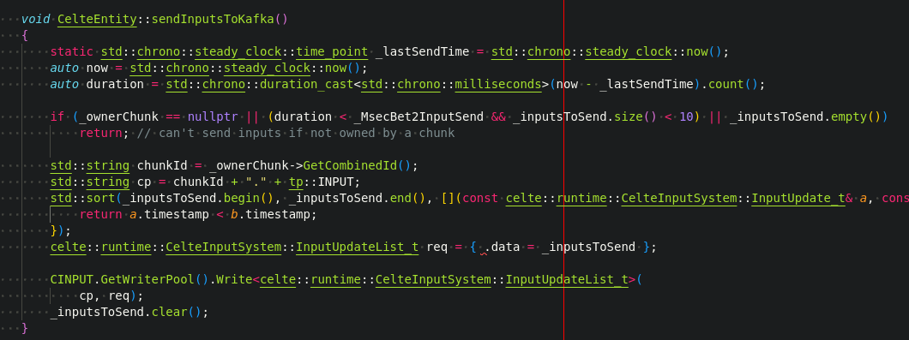
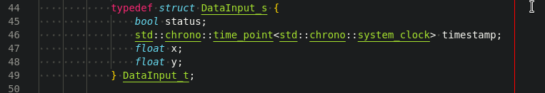
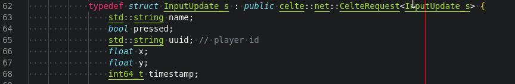
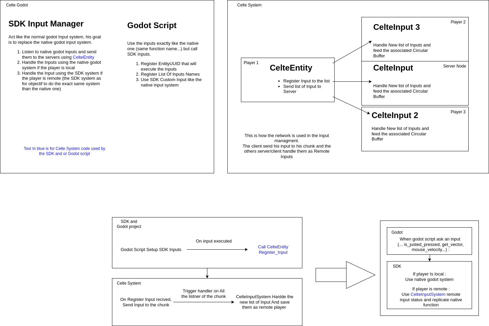

# Celte Input System

The **CelteInputSystem** is mainly developed in the **Engine Extension**. Inside the SDK you will find the basic system to send, receive and store inputs.

It's up to the **Engine Extention** to use the stored data.

Most of the code will be present in 3 files (and their associated headers)

### CelteChunk

This part is a pretty simple and basic code, it consist to create a topic for the inputs. Every client and server connected will see and handle the inputs sent.

As you can see it will take a List of input as arguments, this structure is defined in the CelteInputSystem.hpp and call the HandleInput from the same file.

### CelteEntity

This file will mainly consist of sending the inputs. A function *registerInputToSend* is used from the **Engine Extention** to register an input to the list to send.

The second function consists in sorting the inputs by timestamp and sending them to **Pulsar.** A logic is in place to determine when we send the list but he's open to a later optimisation and R&D phase, be careful it will change.

### CelteInputSystem

The main part is here, he's composed of 2 different parts, the **Handler** that will store any new input to the map and the list of G**etters.**

You can also find in this file the definition of the **DataInput_s** the **InputUpdate_s** and the **InputUpdateList_t** with there appropriated json serializer and deserializer.

This structure is what is stored in the buffer, there is the status (pressed or not) the timestamp (from the client side) and the X and Y for mouse or other position needed

This structure is what will be sent from the client, it has the **DataInput_s** arguments but also the name of the input and the uuid of the entity (the player id)

Finally, the **InputUpdataList_t** is a simple structure composed of only a **std::vector<InputUpdate_s>**

### To Sumarize

Here is an overview of the Interaction between the **SDK**, **Godot** and the **Godot Extention**

For more explanation on the Engine extension, take a look at the associated documentation

