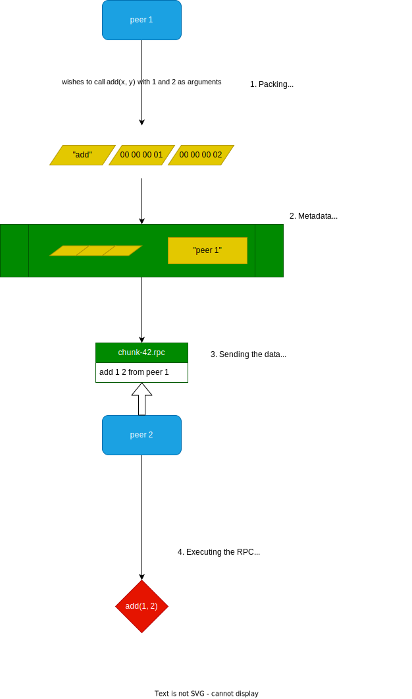
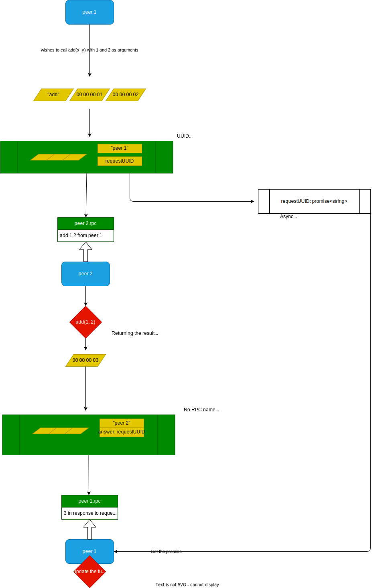

# Remote Procedure Calls

Server Nodes and clients have the ability to call for some logic to be executed remotely on another peer. If needed, the returned value can be awaited.

This is used to trigger behaviors remotely, as well as to get access to information that is not available locally.

# Simple example : no return value

The basic flow of an RPC call is described by the following diagram.



Codewise, this is done using the following code in CelteRPC.hpp:

```c++
template <typename... Args>
  void InvokeByTopic(const std::string &topic, const std::string &rpName,
                     Args... args) {
    // Arguments are serialized using msgpack and stored to a shared pointer.
    std::shared_ptr<std::string> serializedArguments = __serialize__(args...);

    // The record will hold the binary data of the arguments.
    auto record = kafka::clients::producer::ProducerRecord(
        topic, kafka::NullKey,
        kafka::Value(serializedArguments->data(), serializedArguments->size()));

    // Generating a unique id corresponding to this call, in case it must be resent or referenced
    // later.
    std::shared_ptr<std::string> rpcUUID = std::make_shared<std::string>(
        boost::uuids::to_string(boost::uuids::random_generator()()));

    // Set the headers of the record to hold the name of the remote procedure
    // and its UUID
    auto rpNamePtr = std::make_shared<std::string>(rpName);
    record.headers() = {
        {kafka::Header{
            kafka::Header::Key{"rpcUUID"},
            kafka::Header::Value{rpcUUID->c_str(), rpcUUID->size()}}},
        {kafka::Header{
            kafka::Header::Key{"rpName"},
            kafka::Header::Value{rpNamePtr->c_str(), rpNamePtr->size()}}}};

    // we capture the serialized arguments to avoid a dangling pointer until
    // the message is sent.
    auto deliveryCb =
        [serializedArguments, rpNamePtr,
         rpcUUID](const kafka::clients::producer::RecordMetadata &metadata,
                  const kafka::Error &error) {
          if (error) {
            std::cerr << "An error occured (RPC invoke): " << error.message()
                      << std::endl;
            std::cerr << "Failed to send message: " << serializedArguments
                      << std::endl;
          }
        };

    // Send the message
    __send(record, deliveryCb);
  }
```

The code above is wrapped in various methods to setup the topic correctly depending on the scope of the call. The general logic for the topic name is `id.rpc` where id is the uuid of peer/region of 3d space/logical entity that must be performing the action.

The executing side must have registered the RPC using something like this:

```c++
    RPC.Register("add", [](int a, int b) { std::cout << a + b << std::endl;})
```

Upon receiving the consumer record, the executing side will run the following code:

```c++
    std::string rpName = __getHdrValue__(record, "rpName");
    // Does the rpc exist?
    if (rpcs.find(rpName) == rpcs.end()) {
        // error handling
        return;
    }

    // Retrieve the RPC arguments from the record
    std::string serializedArguments(
        static_cast<const char *>(record.value().data()), record.value().size());

    // Invoke the RPC. The call method will actually unpack the data automatically before calling any otherwise defined logic.
    rpcs[rpName].call(record, serializedArguments);
```

## Awaitable RPCs

Sometime, it is necessary to be able to get the result of an RPC.
On the executing side, the rpc must now be registered like so:

```c++
    RPC.RegisterAwaitable<int, int>("square", std::function([](int x) -> int {
        return x * x;
    }));
```

The process for invoking the RPC is slightly more complex.
The RPC is now called like so:

```c++
  std::future<std::string> result = RPC.Call(RUNTIME.GetUUID(), "square", 2);
```

Note that the result of the call is not yet available to the caller, as it is only an instance of `std::future`.
One may await the result using the following code:

```c++
// This block at most 100 milliseconds for the result to be available.
std::future<std::string> result = RPC.Call(RUNTIME.GetUUID(), "square", 2);
if (result.wait_for(std::chrono::milliseconds(100)) == std::future_status::ready) {
    // The result is still serialized upon reception, so we need to unpack it to use the value.
    int value = 0;
    celte::rpc::unpack<int>(result.get(), value);
}
```

The flow of the RPC is altered:

