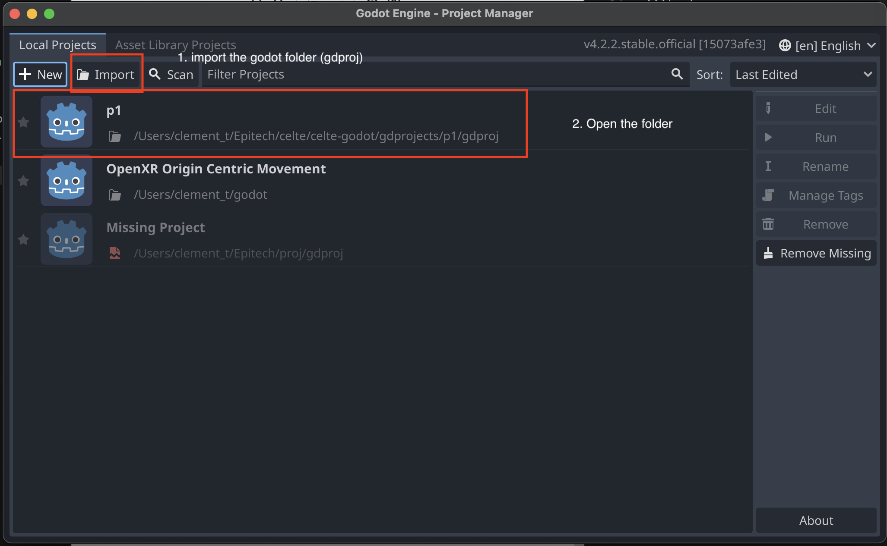

# Overview

This document provides a step-by-step guide to setting up the development environment for the project. The project is developed in four main parts:

## Kafka

[kafka](https://kafka.apache.org/) is a technology that allows for the communication between the different parts of the project. It is a distributed event streaming platform that allows for the communication between the different parts of the project.

To use it you just have to go to the `celte-system` folder and run the following command:

```bash
docker-compose up
```

## Master

Master is the conductor of the orchestra. He is responsible :

* Of the assignation of the different client to the different server nodes.
* He is also responsible for the creation of the different server nodes.

go to the `celte-system` folder and run the following command:

```bash
dotnet run --config configFile.yml
```

The `configFile.yml` is a file that contains the configuration of the different server nodes.
it must have at least:

    ``kafka_brokers: "KAFKA_IP:KAFKA_PORT" ``
    example :
    ``kafka_brokers: "192.168.123.159:80"``

## Godot

The godot project contain the client and the server node.

### godot installation:

    - install godot version``4.2.2``
    - import godot project from the `godot` folder
    

- Run the project:

---

### Link celte-godot to the celte-system:

1. Go to the `celte-system` folder and run the following command:

```bash
./automations/setup_repository.sh PATH-TO.. /celte/celte-godot/gdprojects/p1/gdproj
```

2. Then compile the project in godot.
   go to the `celte-godot/gdprojects/p1` folder and run the following command:

```bash
    make -j
```

⚠️ You must have installed on your machine the following tools:
- `scons`
- `boost`

MAC OS users must install the following packages:
- `boost-python3` : `brew install boost-python3`


# Run the project:

To easily run the project, you can use the `run` script in the `celte-system` folder.

```bash
./run (--cpp (SN), --kafka, --master)
```

# Docker:
There is a docker image containing the celte-system folder and already compiled.
`clmt/celte_server:latest`
This will be use to run the project with the `--cpp` option.