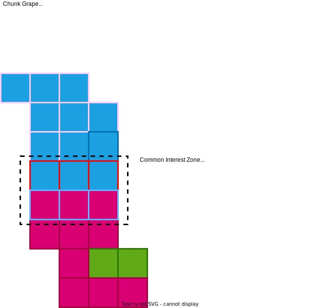
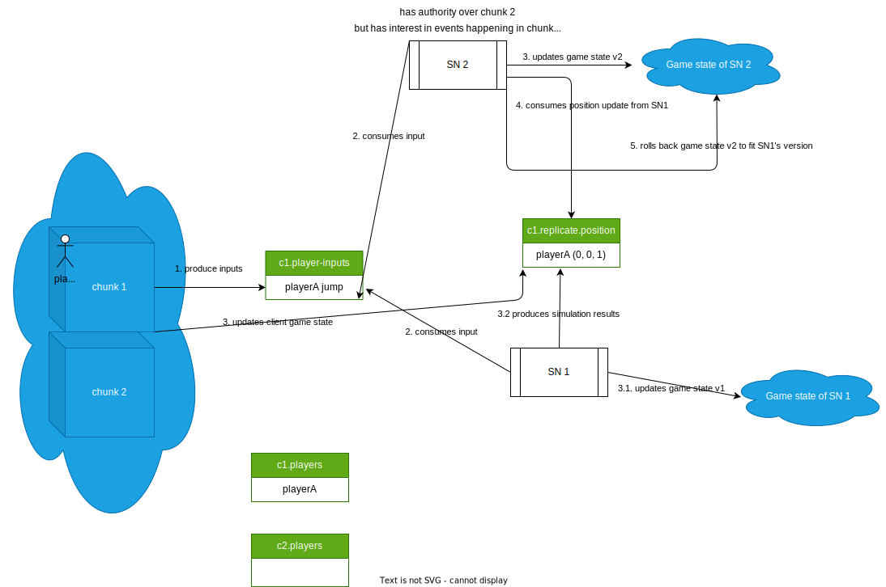
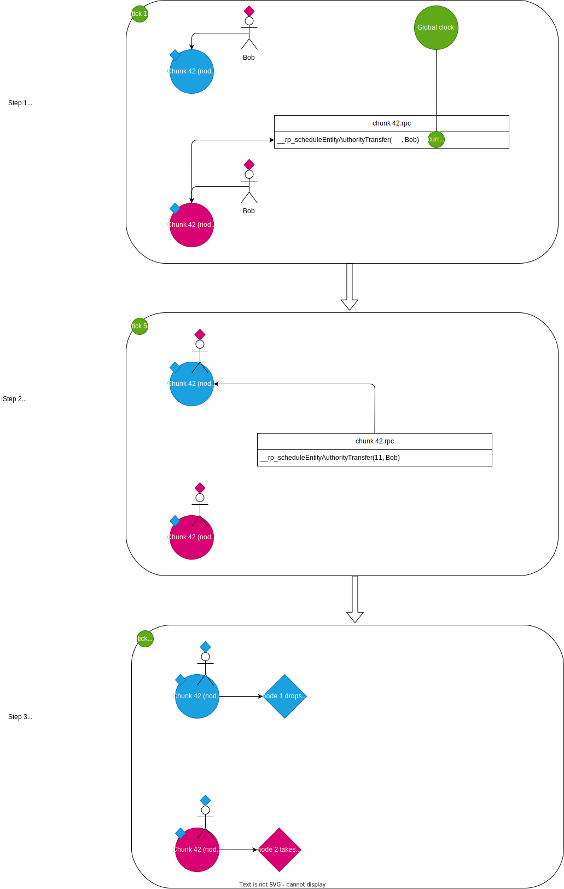
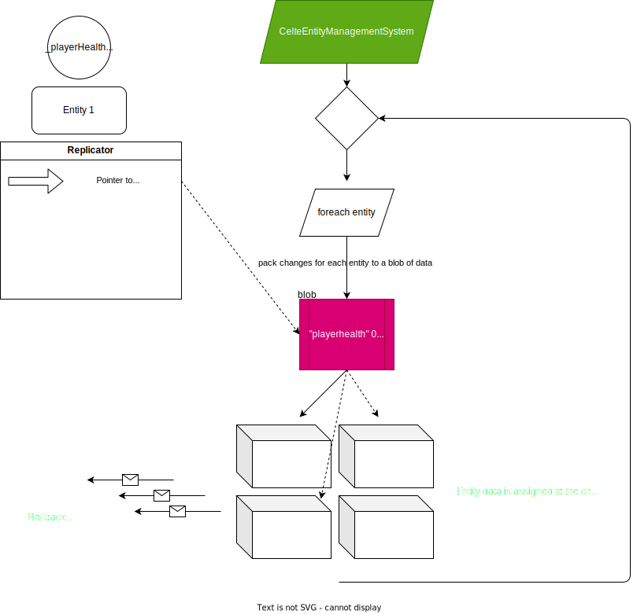

# Server Meshing

# Actors

Celte's architecture revolves around a number of actors, each with a specific role.

## Master Server

The master server's job is to make sure all the other peers are synchronized, redirect new clients to their assigned server node, and load balance the server nodes by reassigning the zones of the 3D game world, or spawning new server instances.

## Server Nodes

Each server node behaves like a classical game server, but is only responsible for a subsection of the game world. Borders between nodes will have other nodes *spying* what is happening and replicating it just like a client would,
in order to ensure that it remains possible to interact between zones that are handled by different server nodes.

# Notions

## Chunks and Grapes

The 3D game world is divided into zones that are **ideally** to be handled by a single server node (to minimize issues caused by the overload of server meshing.) Such a zone is called a `Grape`. It is defined in the game engine by the developer and is identified by its name. Grapes can, in principle, be nested. For example one may have a planet handled by a single server node, but a city on the surface would be handled by a different server.

Grapes are then automatically subdivided into smaller spatial units, called `Chunks`. These Chunks are the smallest container for in game objects, and represent the smallest unit of space that can be observed and replicated at once.
Concretely, all events happening on a given chunk (entity movement, etc) will be streamed to that chunk's kafka topic so that other peer can oberve it and replicate the changes. Grapes being subdiveded into chunks means that other server nodes can choose to observe any subset of a grape to provide interactions between the servers, but without having to double their workload.

## Authority transfer

Having multiple servers running spatial zones that are close by causes various issues of synchronization. Specifically, knowing which of the dedicated servers has the final say over the state of an entity can be complex.

The adopted strategy is to say that the authority over an entity is determined by the spatial position of an entity.
When the entity changes chunk, the authority is passed to the new chunk (and thus to its owner server node).
To ensure good synchronization of the authority transfer, an entity entering a chunk will not change its ownership immediately, but instead schedule it for later, in order to ensure that all peers have had time to receive the notification of this change and are prepared to act accordingly. This synchronization is achieved using the global clock ticks.

## Property Replication

The results computed by server nodes are replicated to the clients so that they can rollabck in case of incorrect predictions.
There are two ways to replicate the data: one is **passive** and the other is **active**. Replicating passively means that Celte won't be watching for any change in the data, instead it is the user's responsability to notifiy that a change must be replicated using `CelteEntity::NotifyChange` on the entity concerned by the change. This saves computing resources as no check is required to verify if the value has changed. The active way on the other hand will continuously recalculate a checksum of the value being watched and replicate it if the checksum changes.

The data is kept as a pointer to the real data, saved in a map with a unique name for that particular variable. Upon receiving the changes, the client side will go to that pointer by reading the address in the local version of the map, and simply overwrite the value in place.

**Warning:** This operation is not thread safe! Do not use property replication directly with variables involved in multithreading operations.

