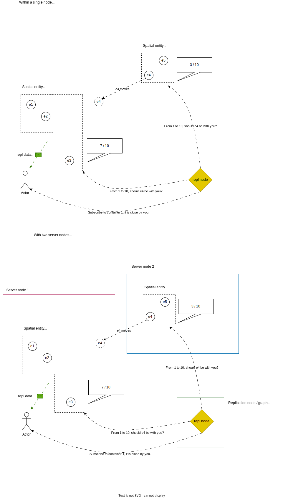

# Motivation

Traditional multiplayer game servers are tasked with transmitting updates about the state of game entities to all connected clients. However, as the number of both clients and entities increases, this approach becomes inefficient, leading to excessive bandwidth consumption and CPU overhead. To address this challenge, it becomes essential to limit the number of replicated entities sent to each client based on relevance.

Rather than replicating all entities indiscriminately, we propose a system capable of determining which entities are relevant to specific clients. This system, known as a replication graph, optimizes entity replication by dynamically assessing relevance based on customizable logic.

In conventional game servers, the replication graph resides on a single server, which actively handles data replication for all connected clients. The logic determining relevance is typically tailored to the specific requirements of the game, necessitating high customizability by developers. However, with the introduction of server meshing, where the workload is distributed across multiple server nodes, the replication graph must not only maintain this customizability but also enable seamless interaction between the replication graphs of different nodes.

# Principle

## Replication Nodes

The replication graph is composed of a set of replication nodes, each implementing custom logic to decide whether a given entity should be replicated to a particular client. By default, this decision may be based on the entity’s spatial position. However, developers can implement additional criteria, such as team membership or global relevance, to determine which entities are replicated.

The replication graph continuously queries its nodes to evaluate whether an entity should be replicated to a client. If at least one replication node returns a positive response, the client subscribes to the corresponding entity container topic. Conversely, if all nodes respond negatively, the client unsubscribes from the topic if subscribed (or takes no action otherwise).

## Entity Containers

Traditionally, entities are replicated individually from the server to each client. This approach, while straightforward, incurs significant bandwidth overhead, especially in environments with numerous clients and entities. To optimize performance, we group entities into entity containers, which are replicated collectively. This approach offers several advantages:
	1.	Efficient Iteration: Replication nodes evaluate entity groups rather than individual entities, reducing computational overhead.
	2.	Reduced Bandwidth: A single entity container can be replicated to a shared messaging topic, enabling a single data upload to serve all subscribed clients. Leveraging scalable messaging systems like Apache Pulsar, the server can handle the high traffic demands associated with large-scale multiplayer games.

Despite these benefits, entity grouping introduces additional complexity in assigning entities to containers. For example, spatial containers may dynamically adjust their size to maintain a consistent number of entities, splitting or merging as needed. While rare, entities may belong to multiple containers. In such cases, the resulting duplicate replication data should remain manageable if kept within acceptable limits (though this requires further quantification).

Conflict Resolution in Entity Assignment

When multiple replication nodes suggest different containers for the same entity, the assignment is resolved using predefined rules. For example:

| Answer from$S_1$ / Answer from $S_2$ | Weak no                                                                          | No                                                                               | Yes                                         | Strong Yes                                                             |
| ---------------------------------------- | -------------------------------------------------------------------------------- | -------------------------------------------------------------------------------- | ------------------------------------------- | ---------------------------------------------------------------------- |
| Weak no                                  | entity not assigned unless not owned by any container (if so, random assignment) | entity assigned to$S_2$ if not owned by any container                          | Entity assigned to$S_2$                   | Entity assigned to$S_2$                                              |
| No                                       | entity assigned to$S_1$ if not owned by any container                          | entity not assigned unless not owned by any container (if so, random assignment) | Entity assigned to$S_2$                   | Entity assigned to$S_2$                                              |
| Yes                                      | Entity assigned to$S_1$                                                        | Entity assigned to$S_1$                                                        | Entity assigned to either$S_1$ or $S_2$ | Entity assigned  to$S_2$                                             |
| Strong Yes                               | Entity assigned to$S_1$                                                        | Entity assigned to$S_1$                                                        | Entity assigned to$S_1$                   | Entity assigned to both$S_1$ and $S_2$ (avoid as much as possible) |

A scoring mechanism (e.g., a value between 0 and 1) could replace binary responses, providing more nuanced control over assignment decisions.

## Multi-Server Node Graphs

While replication graphs typically operate on a single server, server meshing introduces multiple server nodes to distribute workload. This raises the challenge of coordinating replication graphs across nodes. For instance:
	•	How does a replication graph on node $S_1$ detect that a client managed by node $S_2$ may require an entity from $S_1$?
	•	How is an entity reassigned from a container on $S_1$ to one on $S_2$?

A potential solution involves defining server node boundaries as spatial colliders that detect entities entering a node’s domain. Upon entry, the replication graph evaluates whether the entity should be reassigned to a local container. To ensure consistency, replication graphs on different nodes must compare their results and negotiate ownership. Importantly, non-spatial criteria for entity reassignment should not override spatial container ownership, as this could cause entities to visually disappear from nearby clients without explanation.

This system represents a robust and flexible approach to optimizing entity replication in large-scale multiplayer environments, particularly those employing server meshing architectures.

## Overloaded server nodes

In some cases, server nodes might have too many entities to manage. In this case, the master server will create another server node, and this new server node will take ownership of some containers of the overloaded node.

## Overloaded containers

If a container starts to have too much data going through it, it should be able to split (or inversely, to merge) with another container in order to ensure that the number of replicated entities stays optimal.

## possible improvements

- predictive replication : try to predict if a client will have to start replicating an entity and do it sooner than absolutely needed.
- fault tolerance : if a server node fails, another server node must handle its entities. thus all entities must, at all time, be replicated by at least two server nodes so that one may takeover if the other fails.
- possibiliy to offset replication graph decision making to an external, centralized (?) program to reduce the load on the server nodes and improve consistency.
- what about low priority entities

# Schemas

