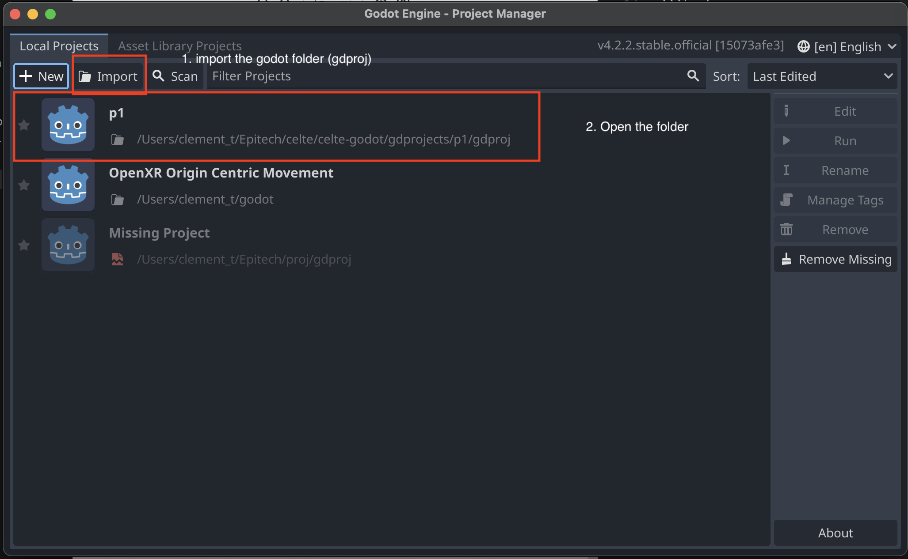

# Overview

This document provides a step-by-step guide to setting up the development environment for the project. The project is developed in four main parts:

## Pulsar

[Pulsar](https://pulsar.apache.org/) is a distributed messaging and event-streaming platform designed to provide high performance, scalability, and flexibility. It enables real-time data processing and is widely used for use cases like message queuing, pub-sub systems, and streaming data pipelines.

To use it you just have to go to the `celte-system` folder and run the following command:

```bash
./automations/run --pulsar
```

## Master

Master is the conductor of the orchestra. He is responsible :

* Of the assignation of the different client to the different server nodes.
* He is also responsible for the creation of the different server nodes.

go to the `celte-system` folder and run the following command:

```bash
dotnet run --config configFile.yml
```

The `configFile.yml` is a file that contains the configuration of the different grapes
```
grapes:
    - LeChateauDuMechant
    - LeChateauDuGentil
```

## Godot

The godot project contain the client and the server node.

### godot installation:

    - install godot version``4.2.2``
    - import godot project from the `godot` folder



- Run the project:

---

### Link celte-godot to the celte-system:

1. open at least one the project in godot.
2. Go to the `celte-system` folder and run the following command:

```bash
./automations/setup_repository.sh PATH-TO.. /celte/celte-godot/gdprojects/p1/gdproj
```

3. rm godot-cpp then git clone the cpp module then git switch to 4.2

   ```bash
   rm -rf godot-cpp ; git clone git@github.com:godotengine/godot-cpp.git ; cd godot-cpp ; git checkout 4.2
   ```
4. go to `celte-system/system/build` and run the following command:

```bash
    cmake install .
```

5. Then compile the project in godot.
   go back to ``celte/celte-godot/gdprojects/p1`` and run the following command:

```bash
make
```

⚠️ You must have installed on your machine the following tools:

- `scons`
- `boost`

MAC OS users must install the following packages:

- `boost-python3` : `brew install boost-python3`

# Run the project:

To easily run the project, you can use the `run` script in the `celte-system` folder.

```bash
./automations/run (--pulsar, --master)
```

# Docker:

There is a docker image containing the celte-system folder and already compiled.
`clmt/celte_server:latest`
This will be use to run the project with the `--cpp` option.
