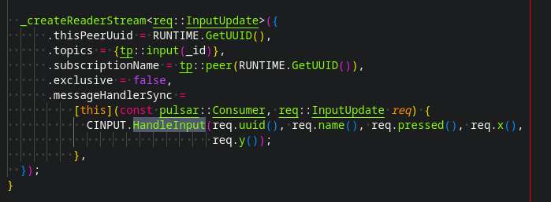
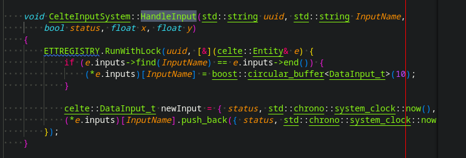
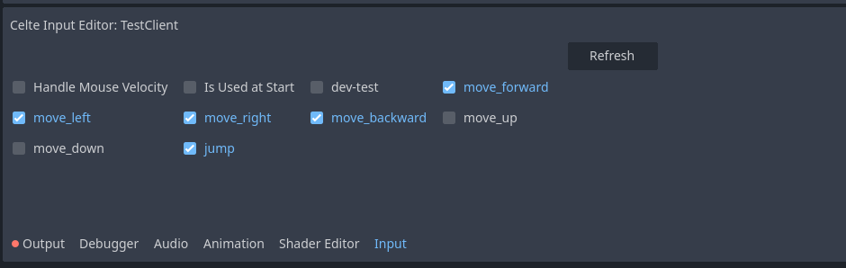
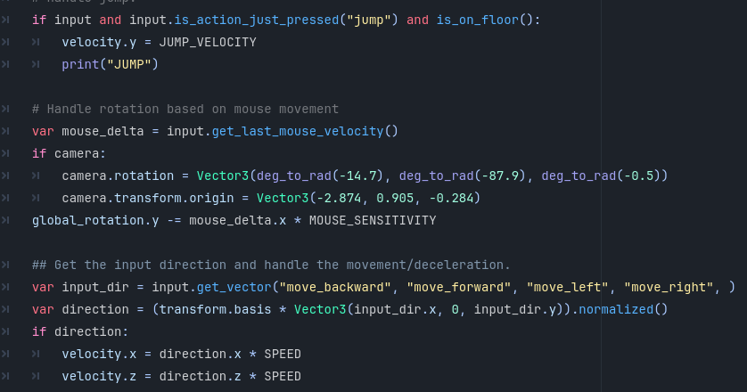
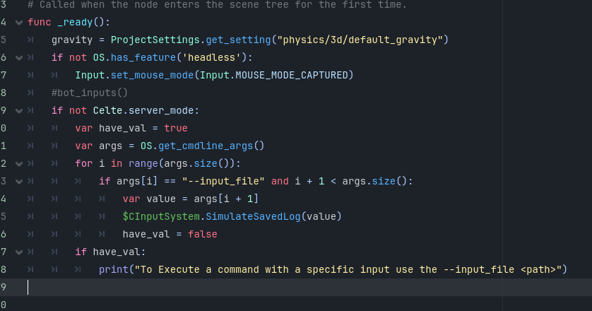

## Celte Input System

### Overview

The Celte System is pretty simple. It consists of one dedicated channel per server, one class to handle the uploaded inputs, and a storage system to store those inputs.

### RPC system and dedicated channel



As you can see, we create a Stream inside Container.cpp. This way, each container has its own dedicated input channel. Clients and other containers will subscribe to it to receive new inputs.

### Handling inputs by the System



Here we have the handler that runs every time we receive an input in the channel.
It simply stores the input inside the database, which is located in Entity.hpp.
This data will later be used by the engine extension.


## Implementation inside Godot Extension

### Overview

The goal of this extension is to:

1. If we are currently a client, check the pressed inputs and send them using the network SDK in the container channel
2. Replace all the input logic (basically all the native Godot
   functions like is_pressed, is_released...)
3. Save inputs inside a file for debugging
4. Simulate inputs from a log file

### How to use inputs

#### Set the Node

The first step is to add a CInputSystem node as a child to your entity


#### Set the input to Replicate

Then, use the UI in Godot to specify which inputs need to be replicated, including the mouse position if necessary.
Finally, if this node is the one used when starting the game, you must set the appropriate boolean to true.
(You can imagine having multiple CInput nodes in different entities like cars or spaceships and use the boolean to dynamically switch control.)


#### Use the Function

Now that everything is set up, you can simply use the same functions as the native system.
But instead of calling them from the Input singleton, call them from the CInput node attached to your entity.



### How to use the player input log

We have a system that saves all player-executed inputs into logs using the node ID.

To do this, you can use a dedicated Godot project that takes the path to an input file as an argument.
You can find it under: celte-godot/projects/test_scenes/input_sim/

```
godot . --input_file <path to the input log file>
```

If you want to add this system to your own Godot project, you just need to:

1. Set the CInputSystem argument "Is Used at Start" to false
2. In the _ready function of your Godot player script, call SimulateSavedLog(path_to_the_file) on the CInput node



**!! Be careful to call the SimulateSavedLog function only in client mode !!**

As shown in the example, you can also extract the path from the launch arguments.
You can modify this logic to better fit your project.
