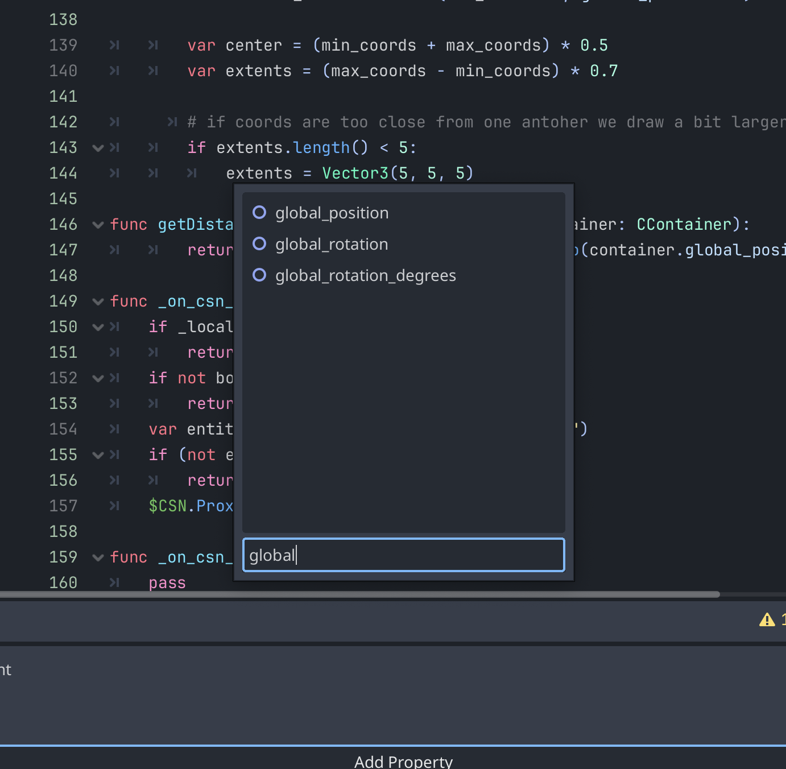

# Replicating properties using Celte

Game objects properties can be replicated over the network, but doing so is a complex task as each property can have a different logic for its replication.
As Celte is not yet tightly integrated in a game engine, changes in properties are currently broadcasted to the topic of the entity container owning the entity only if the property has been registered manually as being replicated.
The user can define callbacks to update the value of properties directly into the engine.

Clients send their inputs to the input channel of the entity container that contains their avatar. All clients can use that input to simulate the client entity. Other entities have to be correctly synchronized for simulation, keeping random values only to the server.
Any discrepency between the simulated values and the real one on the server node can be corrected by doing a rollback to the replicated property when an update is sent to the replication topic of the entity container owning the entity.

## GODOT API

The Celte API for godot has in editor bindings for configuring property replication. This section details how to use it.

The first step is to select a `CEntity` object in your project's hierarchy.

Upon selecting it, a new `replication` menu will appear at the bottom of your editor.

Clicking it opens the following UI:

To add a new replicated property, click `Add Property`.
In the tree view that opens, you will see the subtree relevant to the CEntity you picked.

Double click on the node that has the property that you wish to replicate on the network.

You will see a list of the properties available to be replicated. Only a selection of types are available for replication, but more will be added progressively.

Click the property you wish to replicate. You can use the search bar at the bottom to filter the properties.

A final screen will display after selecting the property, with the following options:

- Is Angle : if checked, the property will be considered an angle and be interpolated using the shortest path to the target value.
- Interpolate : Checking this option makes a spinbox appear. Properties annotated as interplated won't snap directly to the value sent by the server but will smoothly transition, taking the specified duration to correct the error.

After clicking ok, the list of replicated properties displays in the replication panel.

Click the remove button to remove the property from the list of saved properties. Do not forget to hit save on your project to save the settings.