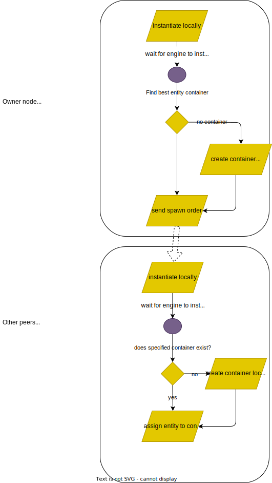

# Spawning an entity or a player

In the context of server meshing, spawning an entity on the network is relatively complexe as it requires correct synchronization of multiple peers.

A client or server can request for the spawn of an entity using one of the following two methods:

```c++
// On server side
//
// payload: custom data passed by the dev to help instantiate the correct prefab
// x, y, z: coordinates of the spawn
// uuid: desired uuid for the entity. leave empty for random value.
void Grape::SpawnEntity(std::string &payload, float x, float y, float z,
                        std::string uuid);

// On client side
// the client can only request its own spawn when it is ready to do so. The server has the right to refuse.
//
// clientId: the id of the client requesting the spawn. The spawned entity will have the same id.
// grapeId: the id of the grape to spawn in. this information is usually obtained in previous calls when connecting to the server for the first time, or though gameplay
// payload: custom data passed to the in game callback that will instantiate the entity.
void CelteRuntime::RequestSpawn(const std::string &clientId,
                                const std::string &grapeId,
                                const std::string &payload)
```

Once the request has been submitted to the server, the steps are as follow:

