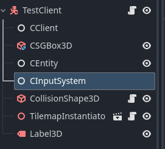

## Celte Input System

### Overview

Inputs are a basic logic in video games, it adds dynamism and interactivity with the player using specific devices.
But it's also one of the hardest things to optimize especially for the network. To counter cheating you need to send all the inputs of all players to the server, this puts a lot of data to send every tick which make it an important part of the optimization.
The system we use is a common one, you send the input to a specific channel to the server, the server treats the data and send the result to another client.
So we have one dedicated channel per server, one class to handle the uploaded inputs, and a storage system to store those inputs.

### RPC system and dedicated channel

```C++
  _createReaderStream<req::InputUpdate>({
      .thisPeerUuid = RUNTIME.GetUUID(),
      .topics = {tp::input(_id)},
      .subscriptionName = tp::peer(RUNTIME.GetUUID()),
      .exclusive = false,
      .messageHandlerSync =
          [this](const pulsar::Consumer, req::InputUpdate req) {
            CINPUT.HandleInput(req.uuid(), req.name(), req.pressed(), req.x(), req.y());
          },
  });
```

As you can see, we create a Stream inside Container.cpp. This way, each container has its own dedicated input channel. Clients and other containers will subscribe to it to receive new inputs.

### Handling inputs by the System

```C++
    void CelteInputSystem::HandleInput(std::string uuid, std::string InputName,
        bool status, float x, float y)
    {
        ETTREGISTRY.RunWithLock(uuid, [&](celte::Entity& e) {
            if (e.inputs->find(InputName) == e.inputs->end()) {
                (*e.inputs)[InputName] = boost::circular_buffer<DataInput_t>(10);
            }

            celte::DataInput_t newInput = { status, std::chrono::system_clock::now(), x, y };
            (*e.inputs)[InputName].push_back({ status, std::chrono::system_clock::now(), x, y });
        });
    }
```

Here we have the handler that runs every time we receive an input in the channel.
It simply stores the input inside the database, which is located in Entity.hpp.
This data will later be used by the engine extension.

## Implementation inside Godot Extension

### Overview

The goal of this extension is to:

1. If we are currently a client, check the pressed inputs and send them using the network SDK in the container channel
2. Replace all the input logic (basically all the native Godot
   functions like is_pressed, is_released...)

here you can see an exemple, the first step is to check if we currently are the client and if it's the case we use godot system to treat the input.
In the other case et do the same operation than godot but using our own input database, this database is feed by the celte network

```C++
void CInputSystem::action_press(String actionId) {
	CEntity *entity = get_parent()->get_node<CEntity>("CEntity");
	if (!entity) {
		UtilityFunctions::push_error("CInputSystem must have a sister node of type CEntity");
		return;
	}
	std::string eid = entity->GetIdStd();

	if (IsLocalClient()) {
		Input *input = Input::get_singleton();
		if (input) {
			input->action_press(actionId);
			CAPI::GetHandle().UploadInputData(eid, actionId.utf8().get_data(), true, 0, 0);
		} else
			UtilityFunctions::push_error("Celte Input singleton is not set, please set it in the autoloads.");
	}
}
```

Keep in mind to make the associated bindings for godot script

```C++
void CInputSystem::_bind_methods() {
   	ClassDB::bind_method(D_METHOD("action_press", "actionId"),
			&CInputSystem::action_press);
}
```

### How to use inputs

#### Set the Node

The first step is to add a CInputSystem node as a child to your entity


#### Set the input to Replicate

Then, use the UI in Godot to specify which inputs need to be replicated, including the mouse position if necessary.
Finally, if this node is the one used when starting the game, you must set the appropriate boolean to true.
(You can imagine having multiple CInput nodes in different entities like cars or spaceships and use the boolean to dynamically switch control.)


#### Use the Function

Now that everything is set up, you can simply use the same functions as the native system.
But instead of calling them from the Input singleton, call them from the CInput node attached to your entity.

```python
func _physics_process(delta):

	var entity: CEntity = get_node("CEntity")
	if not entity.IsOwnedByCurrentPeer():
		pass
	# Add the gravity.
	if not is_on_floor():
		velocity.y -= gravity * delta

	var input = get_node("CInputSystem")
	# Handle jump.
	if input and input.is_action_just_pressed("jump") and is_on_floor():
		velocity.y = JUMP_VELOCITY
		print("JUMP")

	# Handle rotation based on mouse movement
	var mouse_delta = input.get_last_mouse_velocity()
	if camera:
		camera.rotation = Vector3(deg_to_rad(-14.7), deg_to_rad(-87.9), deg_to_rad(-0.5))
		camera.transform.origin = Vector3(-2.874, 0.905, -0.284)
	global_rotation.y -= mouse_delta.x * MOUSE_SENSITIVITY

	## Get the input direction and handle the movement/deceleration.
	var input_dir = input.get_vector("move_backward", "move_forward", "move_left", "move_right", )
	var direction = (transform.basis * Vector3(input_dir.x, 0, input_dir.y)).normalized()
	if direction:
		velocity.x = direction.x * SPEED
		velocity.z = direction.z * SPEED
	else:
		velocity.x = move_toward(velocity.x, 0, SPEED)
		velocity.z = move_toward(velocity.z, 0, SPEED)

	move_and_slide()
	if not Celte.server_mode:
		call_deferred("update_animation")

```
