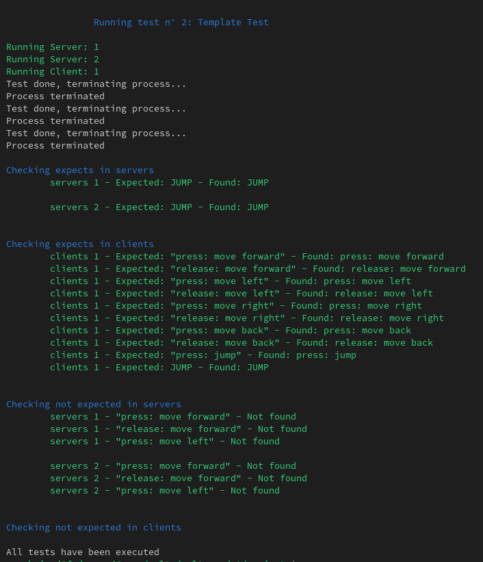
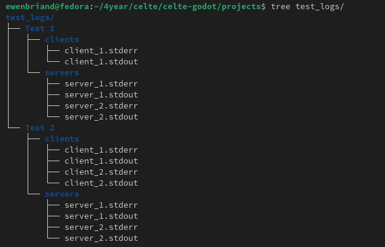

# How to create a functional test

## 1. Create a godot project

The first step is to create a Godot project. This project must be minimalist and only test one feature (input sending and receiving, spawning an entity...).
This scene will print a console log that will be captured by the testing script.

## 2. Update the yaml file

The YAML file is composed of a list of tests; here is an example of a test:

```yaml
tests:
    - name: "Test 1"
        path: "./template/"
        timeout: 30
        server:
            number: 2
            wait-string: "Press Space to exit..."
            delay: 3

        client:
            number: 1
            wait-string: "Container is ready!"
            delay: 3

        expects:
            servers:
                1:
                    - "JUMP"
                2:
                    - "JUMP"

            clients:
                1:
                    - "press: move forward"
                    - "release: move forward"
                    - "press: move left"
                    - "release: move left"
                    - "press: move right"
                    - "release: move right"
                    - "press: move back"
                    - "release: move back"
                    - "press: jump"
                    - "JUMP"
      
        not-expects:
            servers:
                1:
                    - "press: move forward"
                    - "release: move forward"
                    - "press: move left"
                2:
                    - "press: move forward"
                    - "release: move forward"
                    - "press: move left"

```

You will find in the yaml:

* Name     : Name of the test.
* Path     : Path to the previously created Godot project.
* Timeout  : If not all matches are found within the time limit, the test will be considered failed.
* Server/Client:
* * Number      : Number of servers or clients to start.
* * Wait-String : When this string is matched, a new server or client will be created.
* * Delay       : The delay between two server or client creations.
* Expects:
* * Servers : A list where each server is associated with a list of strings to be matched.
* * Clients : A list where each client is associated with a list of strings to be matched.
* Not-Expects:
* * Servers : A list where each server is associated with a list of strings that shouldn't be matched.
* * Clients : A list where each client is associated with a list of strings that shouldn't be matched.

## 3. Run the new created test

Ensure that Redis, Pulsar, and the master are running.
You can use ``./automation/run --redis/pulsar/master`` in celte-system

Now that you have updated the YAML file and created the Godot project, you can launch the test using "./autotest". Its first argument must be the YAML file.

```bash
./autotest config.yaml
```




The STDOUT and STDERR of all processes (clients/servers) can be found in the "test_logs" directory.


