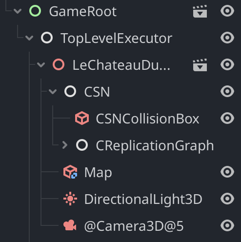

# Instantiating entities in your game with Celte

On of the most basics things a networked game can do is to spawn objects into the game world.
A couple of basic rules first:
- Only servers should have the authority to create a new entity on the network
- It is the responsability of the game developer to ensure that the Celte systems are correctly setup for each entities. This section will guide you through this process.

## Scene hierarchy

Celte assumes a certain hierarchy in your game.
This only concerns the top level of your node tree in Godot, to ensure that Celte can find its core elements in the scene.


It is recommanded to setup Celte at the top level of the node tree, and have the different parts of the game world loaded as children of Celte's `TopLevelExecutor`.

At runtime, the node tree should look something like this:



- Each portion of the map that is to be managed by a single server must have a node of type `CSN` as its direct child.
- The `CSN` nodes must have a `CReplicationGraph` as its direct child.

## Initializing a Celte Scene

Run the following code when instantiating your scene:

```python
func Init(name: String, locallyOwned: bool):
	if (name == "LeChateauDuMechant"):
		colorDebug = Color(1, 0, 0)
	else:
		colorDebug = Color(0, 0.3, 0.5)
	$CSN.Init(name, locallyOwned, func(): call_deferred("grapeIsReadyCb"))
	$CSN/CReplicationGraph.SetMetricToGetDistanceToContainer(getDistanceToContainer)
	$CSN/CReplicationGraph.SetDebugAssigns(debugAssign)
```
- `name` is the name of the scene being loaded.
- `locallyOwned` should always be false on client side. It should be true if and only if the current peer should be responsible for managing the state of the entities affiliated to this sub tree.
- `SetMetricToGetDistanceToContainer` is a custom callback related to load balancing entities between subdivisions of the node tree, it will be discussed later.
- `SetDebugAssign` is used to define a customizable callback to visualize containers, it will be discussed later.
- `grapeIsReadyCb` is the name of the function that you wish to call when the systems are network ready (done initializing).

```python
func grapeIsReadyCb():
if Celte.server_mode and $CSN.IsLocallyOwned():
    # create an initial container to host incoming entities
    var container = $CSN/CReplicationGraph.CreateContainer(
        func(): # callback called when the network of the container is ready to be used
            print("Container is ready!")
    )
    container.position = $CSN.position
```

- In order to manage entities and load balance them, we need to define at least one entity container in our server. We do so using the replication graph. Later, more containers can be created to load balance the workload of the server.

## Instantiating entities

Now that the servers are ready, lets see how we can create an entity and add it to our scene. There are three ways that an entity can be instantiated:
- from the initiative of the current peer if it is a server
- from the initiative of another peer (remote server)
- any of the above but the entity represents a remote client and should represent this connection (as an avatar)

### Instantiating locally (Owner server side)

Keep in mind that the order into which the following functions are called is important, as the different parts of Celte systems need to be synchronized.

```python
func instantiatePrefab(assetName: String):
    # Create your object.
	var obj = load("res://Prefabs/" + assetName + ".tscn").instantiate()
	obj.position = Vector3(-5, 0, -5) # anything goes here

    # A direct child of the object should be of type CEntity
	var centity: CEntity = obj.get_node("CEntity")

    # The payload will be sent to other peers to help them load the entity
	centity.SetPayload({
			"filepath": "TestEntity",
			"isClient": false,
			"where": get_path(),
            "name": obj.get_name()})

    # Adding the entity to the node tree.
	add_child(obj)

    # Instantiating the entity on the network.
	$CSN/CReplicationGraph.InstantiateEntity(obj,
	    func(): pass)

    # Remembering the pointer to the entity for faster access.
	Celte.api.SetETTNativeHandle(centity.GetId(), centity)
```

- Node that the InstantiateEntity method of the CReplicationGraph is the method deciding of the id of the entity over the network. This is why it must be called before accessing the id of the entity, for example in SetETTNativeHandle.

### Instantiating a client locally

The logic is the same, but we need to account for the fact that the entity represents a client.

```python
func instantiateClient(assetName: String, clientId: String):
	var obj = load("res://Prefabs/" + assetName + ".tscn").instantiate()
	obj.position = Vector3(0, 0, 0)
	var centity: CEntity = obj.get_node("CEntity")
	obj.get_node("CClient").SetId(clientId) # this is the difference with centity
	centity.SetPayload({
			"filepath": "TestClient",
			"isClient": true,
			"clientId": clientId,
			"where": get_path(),
			"name": obj.get_name()})
	add_child(obj)
	$CSN/CReplicationGraph.InstantiateEntity(obj,
		func(): pass)
	Celte.api.SetETTNativeHandle(centity.GetId(), centity)
```

### Instantiating on a remote peer (Client side or non owning server side)

In the code block above, the `InstantiateEntity` of the replication graph will call a hook in all peers that should be instantiating the entity.

```python
func instantiateFromPayload(ettId: String, payload: Dictionary):
	var assetName = payload["filepath"]
	var obj = load("res://Prefabs/" + assetName + ".tscn").instantiate()

	# position is not set now, will be when we have replication data
	if Celte.server_mode:
		obj.get_node("CEntity").SetPayload(payload)
	obj.get_node("CEntity").SetId(ettId)
	if (payload["isClient"]):
		obj.get_node("CClient").SetId(payload["clientId"])
	add_child(obj)
	Celte.api.SetETTNativeHandle(ettId, obj.get_node("CEntity"))
```